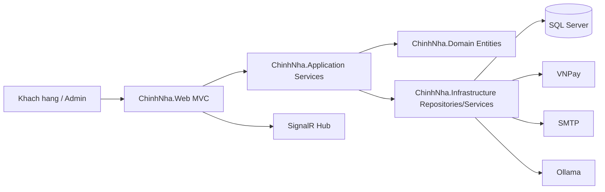

# Đồ Án: Hệ Thống Website Bán Vật Tư Nông Nghiệp Chính Nha

## Thông Tin Tổng Quan
- **Tên dự án:** Hệ thống Website Bán Vật Tư Nông Nghiệp Chính Nha (ChinhNha)
- **Mô tả ngắn:** Nền tảng thương mại điện tử vật tư nông nghiệp cho phép khách hàng tìm kiếm, mua hàng, thanh toán VNPay, theo dõi đơn; đồng thời cung cấp trang quản trị để vận hành danh mục, kho, đơn hàng, blog, chatbot AI và phân tích gợi ý sản phẩm.
- **Công nghệ sử dụng:** ASP.NET Core MVC (.NET 8), Entity Framework Core 8, SQL Server, SignalR, ML.NET, Semantic Kernel, Ollama, AutoMapper, FluentValidation, EPPlus, Bootstrap, Razor View Engine.
- **Đối tượng người dùng:** Khách vãng lai, khách hàng đã đăng ký, quản trị viên (Admin).
- **Môi trường chạy:** Windows 10/11 (khuyến nghị), có thể chạy trên Linux với .NET 8 + SQL Server tương thích; phát triển bằng Visual Studio/VS Code.

---

## 1. Giới Thiệu Dự Án

### 1.1 Bối cảnh và lý do xây dựng
Thị trường vật tư nông nghiệp cần một nền tảng số hóa giúp:
- Trưng bày danh mục sản phẩm rõ ràng theo ngành hàng (phân bón, thuốc BVTV, bạt phủ, ...).
- Tối ưu quy trình đặt hàng, theo dõi đơn, thanh toán trực tuyến.
- Hỗ trợ vận hành kho, nhập/xuất tồn, và gợi ý nhập hàng dựa trên dữ liệu.
- Cải thiện trải nghiệm khách hàng bằng chatbot AI và nội dung blog tư vấn.

### 1.2 Mục tiêu đồ án
- Xây dựng hệ thống web bán hàng nông nghiệp đầy đủ nghiệp vụ thương mại điện tử.
- Áp dụng kiến trúc nhiều lớp để dễ bảo trì, mở rộng và kiểm thử.
- Tích hợp AI/ML thực tế cho chatbot và recommendation analytics.
- Đảm bảo quản trị tập trung với cơ chế audit và backup cơ sở dữ liệu.

### 1.3 Đối tượng sử dụng
- **Khách vãng lai:** xem sản phẩm, tìm kiếm, thêm giỏ hàng theo session.
- **Khách hàng đăng nhập:** quản lý tài khoản, đặt hàng, theo dõi đơn, đánh giá sản phẩm.
- **Admin:** quản trị danh mục/sản phẩm/blog/kho/đơn hàng, giám sát audit, cấu hình AI, sao lưu/phục hồi dữ liệu.

### 1.4 Phạm vi chức năng (Scope)
- Quản lý người dùng và phân quyền theo vai trò.
- Danh mục sản phẩm, biến thể sản phẩm, giỏ hàng, checkout, thanh toán VNPay.
- Quản lý kho, giao dịch tồn kho, nhà cung cấp, nhập kho.
- Quản lý blog nội dung, media, audit log.
- Chatbot AI cho người dùng và admin.
- API hỗ trợ địa chỉ hành chính Việt Nam và chatbot.

---

## 2. Công Nghệ Sử Dụng

### 2.1 Backend
- **ASP.NET Core MVC 8 (net8.0)**
  - Vai trò: framework chính để xử lý request/response, routing, middleware, model binding, validation và rendering Razor View.
  - Lý do chọn: hiệu năng cao, tích hợp tốt với EF Core, DI, middleware pipeline linh hoạt, phù hợp đồ án enterprise nhỏ.

- **Entity Framework Core 8 + SQL Server Provider**
  - Vai trò: ORM ánh xạ entity <-> bảng dữ liệu, migrations, query LINQ.
  - Lý do chọn: giảm boilerplate SQL, chuẩn hóa migration và bảo trì schema.

- **Cookie Authentication + Authorization Policy**
  - Vai trò: xác thực người dùng bằng cookie; phân quyền qua role (`Admin`) và policy (`AdminOnly`).
  - Lý do chọn: phù hợp ứng dụng MVC server-rendered, ít phức tạp hơn JWT trong kiến trúc monolith web.

- **SignalR**
  - Vai trò: thông báo realtime cho admin (ví dụ đơn hàng mới).

### 2.2 Frontend
- **Razor View Engine (.cshtml)**
  - Vai trò: render giao diện server-side, kết hợp model strongly-typed.
- **Bootstrap (giao diện admin/user)**
  - Vai trò: hệ thống lưới, form, component UI giúp triển khai nhanh và đồng bộ.
- **JavaScript phía client**
  - Vai trò: tương tác động (cart count, gọi API địa chỉ/chatbot, UI actions).

### 2.3 Database
- **SQL Server** (khuyến nghị SQL Server 2019/2022 hoặc SQL Express tương thích)
  - Vai trò: lưu trữ dữ liệu nghiệp vụ và lịch sử hệ thống.
  - Cấu hình mặc định trong dự án: `PhanBonChinhNhaDB`.

### 2.4 Authentication
- **Cơ chế:** Cookie-based Authentication (`Microsoft.AspNetCore.Authentication.Cookies`).
- **Login path:** `/Account/Login` (khu user), `/Admin/Auth/Login` (khu admin).
- **Policy:** `AdminOnly` yêu cầu role `Admin`.
- **Guard logic:** redirect động theo area khi chưa đăng nhập.

### 2.5 Payment
- **VNPay (sandbox)**
  - Vai trò: thanh toán trực tuyến cho đơn hàng.
  - Callback endpoints:
    - Return URL: `/vnpay/return`
    - IPN URL: `/vnpay/ipn`
  - Có xử lý retry thanh toán cho đơn đủ điều kiện.

### 2.6 Thư viện/Package quan trọng
| Package | Vai trò |
|---|---|
| `AutoMapper` | Mapping DTO <-> Entity/ViewModel |
| `FluentValidation.DependencyInjectionExtensions` | Tích hợp validation theo rule rõ ràng |
| `Microsoft.EntityFrameworkCore.SqlServer` | Kết nối SQL Server qua EF Core |
| `Microsoft.EntityFrameworkCore.Tools/Design` | Migration và tooling EF |
| `Microsoft.ML`, `Microsoft.ML.TimeSeries` | Dự báo nhu cầu/tồn kho |
| `Microsoft.SemanticKernel` | Tích hợp AI orchestration cho chatbot |
| `Microsoft.AspNetCore.SignalR.Client` | Realtime communication |
| `EPPlus` | Xuất/Nhập Excel (inventory import/export) |
| `xUnit`, `Moq`, `coverlet` | Unit test và đo coverage |

### 2.7 Công cụ hỗ trợ
- **IDE:** Visual Studio 2022 hoặc VS Code.
- **Version Control:** Git + GitHub.
- **API testing:** Postman/Thunder Client/curl.
- **DB tool:** SSMS hoặc Azure Data Studio.
- **AI runtime cục bộ:** Ollama (tuỳ chọn nhưng khuyến nghị cho chatbot AI đầy đủ).

---

## 3. Kiến Trúc Hệ Thống

### 3.1 Mô hình kiến trúc
Hệ thống áp dụng **Clean Architecture / Layered Architecture** trên nền MVC:
- `ChinhNha.Web`: Presentation layer (Controllers, Views, Middleware, Hubs).
- `ChinhNha.Application`: Use cases, DTOs, service interfaces, mapping.
- `ChinhNha.Domain`: Entity, enum, business model cốt lõi.
- `ChinhNha.Infrastructure`: Data access, repositories, external services (SMTP, VNPay, AI integrations).

### 3.2 Sơ đồ tổng quan module


### 3.3 Luồng xử lý chính
Luồng tiêu chuẩn:
1. Client gửi request HTTP đến controller.
2. Controller gọi service ở Application layer.
3. Service xử lý nghiệp vụ, gọi repository ở Infrastructure.
4. Repository truy cập DB qua EF Core.
5. Service trả DTO/ViewModel về controller.
6. Controller trả Razor View/JSON response cho client.

Ví dụ luồng checkout:
- `CheckoutController.Index (POST)` -> validate model -> tạo order từ cart -> nếu VNPay thì tạo URL thanh toán -> callback cập nhật trạng thái payment -> gửi email + SignalR notification.

### 3.4 Cấu trúc thư mục dự án
```text
src/
  ChinhNha.Domain/           # Entity, enum, interface cốt lõi
  ChinhNha.Application/      # DTO, interface service, use-case, mapping
  ChinhNha.Infrastructure/   # DbContext, EF configs, repository, tích hợp ngoài
  ChinhNha.Web/              # MVC app, Area Admin, Views, API endpoints, middleware
tests/
  ChinhNha.Application.Tests/ # Unit tests tầng application
tools/
  ChinhNha.AI.Training/      # Công cụ training/mock data cho ML
docs/                         # Tài liệu kỹ thuật và vận hành
run-web.bat                   # Script chạy nhanh web app
```

---

## 4. Cơ Sở Dữ Liệu

### 4.1 Các bảng chính và quan hệ
- **Users** (1) - (N) **Orders**
- **ProductCategories** (1) - (N) **Products**
- **Products** (1) - (N) **ProductVariants**
- **Carts** (1) - (N) **CartItems**
- **Orders** (1) - (N) **OrderItems**
- **Orders** (1) - (1) **Payments**
- **Suppliers** (1) - (N) **Products**
- **PurchaseOrders** (1) - (N) **PurchaseOrderItems**
- **Products** (1) - (N) **InventoryTransactions**
- **Users** (1) - (N) **ProductRecommendations**

### 4.2 Mô tả bảng quan trọng

#### 4.2.1 Bảng `Users`
| Cột | Kiểu dữ liệu (gợi ý SQL) | Mục đích |
|---|---|---|
| `Id` | `nvarchar(450)` | Khóa chính người dùng |
| `Email` | `nvarchar(256)` | Email đăng nhập (unique) |
| `PasswordHash` | `nvarchar(512)` | Mật khẩu đã băm PBKDF2 |
| `FullName` | `nvarchar(200)` | Họ tên |
| `Role` | `nvarchar(50)` | Vai trò (`Admin`, `Customer`) |
| `IsActive` | `bit` | Trạng thái kích hoạt |
| `CreatedAt` | `datetime2` | Thời điểm tạo |

#### 4.2.2 Bảng `Products`
| Cột | Kiểu dữ liệu | Mục đích |
|---|---|---|
| `Id` | `int` | Khóa chính |
| `Name` | `nvarchar(300)` | Tên sản phẩm |
| `Slug` | `nvarchar(300)` | SEO URL (unique) |
| `SKU` | `nvarchar(50)` | Mã sản phẩm (unique, nullable) |
| `CategoryId` | `int` | FK tới danh mục |
| `SupplierId` | `int` nullable | FK tới nhà cung cấp |
| `ImportPrice` | `decimal(18,2)` | Giá nhập |
| `BasePrice` | `decimal(18,2)` | Giá bán |
| `SalePrice` | `decimal(18,2)` nullable | Giá khuyến mãi |
| `StockQuantity` | `int` | Số lượng tồn |
| `MinStockLevel` | `int` | Ngưỡng cảnh báo tồn |
| `IsFeatured` | `bit` | Đánh dấu nổi bật |
| `IsActive` | `bit` | Trạng thái kinh doanh |

#### 4.2.3 Bảng `Orders`
| Cột | Kiểu dữ liệu | Mục đích |
|---|---|---|
| `Id` | `int` | Khóa chính |
| `OrderCode` | `nvarchar(20)` | Mã đơn (unique) |
| `UserId` | `nvarchar(450)` nullable | Người đặt (có thể null cho guest) |
| `Status` | `int` (enum) | Trạng thái đơn hàng |
| `SubTotal` | `decimal(18,2)` | Tiền hàng |
| `ShippingFee` | `decimal(18,2)` | Phí ship |
| `Discount` | `decimal(18,2)` | Giảm giá |
| `TotalAmount` | `decimal(18,2)` | Tổng thanh toán |
| `ReceiverName` | `nvarchar(200)` | Tên người nhận |
| `ReceiverPhone` | `nvarchar(20)` | SĐT nhận hàng |
| `ReceiverEmail` | `nvarchar(255)` nullable | Email nhận thông báo |
| `ShippingProvince`/`District`/`Ward` | `nvarchar(100)` | Địa chỉ theo cấp hành chính |
| `ShippingAddress` | `nvarchar(500)` | Địa chỉ chi tiết |

#### 4.2.4 Bảng `Payments`
| Cột | Kiểu dữ liệu | Mục đích |
|---|---|---|
| `Id` | `int` | Khóa chính |
| `OrderId` | `int` | FK unique tới Order |
| `PaymentMethod` | `int` (enum) | COD/VNPay |
| `PaymentStatus` | `int` (enum) | Pending/Paid/Failed |
| `Amount` | `decimal(18,2)` | Số tiền |
| `TransactionId` | `nvarchar(100)` | Mã giao dịch cổng thanh toán |
| `PaidAt` | `datetime2` nullable | Thời điểm thanh toán |

### 4.3 Ràng buộc và index quan trọng
- Unique index:
  - `Users.Email`
  - `Products.Slug`
  - `Products.SKU` (filter `IS NOT NULL`)
  - `ProductCategories.Slug`
  - `Orders.OrderCode`
  - `PurchaseOrders.POCode`
  - `Payments.OrderId`
  - `Carts.UserId` (filter `IS NOT NULL`)
- FK và quy tắc xóa:
  - `OrderItems -> Orders`: `Cascade`
  - `OrderItems -> Products`: `Restrict`
  - `Products -> Suppliers`: `SetNull`
  - `Products -> ProductCategories`: `Restrict`
  - `Orders -> Users`: `Restrict` (không xóa user làm mất lịch sử đơn)

---

## 5. Chức Năng Hệ Thống

### 5.1 Chức năng Khách vãng lai / Khách hàng

#### 5.1.1 Đăng ký, đăng nhập, đổi mật khẩu
- Màn hình: `Account/Login`, `Account/Register`, `Account/ChangePassword`.
- Luồng:
  1. Người dùng nhập thông tin.
  2. Hệ thống validate model (email, mật khẩu, confirm password).
  3. Mật khẩu được băm, tạo cookie đăng nhập.
- Xử lý lỗi:
  - Sai thông tin -> trả lỗi ModelState.
  - Chưa xác thực -> redirect về login tương ứng area.

#### 5.1.2 Duyệt/tìm kiếm sản phẩm
- Màn hình: danh sách sản phẩm, chi tiết, lọc theo danh mục slug SEO.
- Luồng: lọc category + search query + phân trang.
- Validation/lỗi:
  - Slug không tồn tại -> trả trang not found hoặc fallback danh sách.

#### 5.1.3 Giỏ hàng
- Chức năng: thêm/xóa sản phẩm, đếm số lượng realtime.
- Hỗ trợ cả guest (`SessionId`) và user đăng nhập (`UserId`).
- Validation/lỗi:
  - Số lượng không hợp lệ -> từ chối thêm.
  - Sản phẩm không tồn tại/hết hàng -> thông báo lỗi.

#### 5.1.4 Đặt hàng và thanh toán VNPay
- Màn hình: `Checkout/Index` -> `Checkout/Success`.
- Luồng:
  1. Validate thông tin người nhận, địa chỉ, phương thức thanh toán.
  2. Tạo order từ cart.
  3. Nếu chọn VNPay -> redirect cổng thanh toán.
  4. VNPay callback (`/vnpay/return`, `/vnpay/ipn`) cập nhật trạng thái thanh toán.
  5. Gửi email và thông báo admin qua SignalR.
- Validation/lỗi:
  - ModelState invalid -> hiển thị trường lỗi cụ thể.
  - Callback không hợp lệ/chữ ký sai -> đánh dấu thanh toán thất bại.

#### 5.1.5 Quản lý tài khoản khách hàng
- Màn hình: dashboard khách hàng, danh sách đơn, chi tiết đơn, cập nhật profile.
- Chức năng: theo dõi trạng thái đơn, thanh toán lại đơn VNPay đủ điều kiện.

#### 5.1.6 Đánh giá sản phẩm
- Chức năng: tạo đánh giá, vote helpful/unhelpful, xóa đánh giá của mình.
- Yêu cầu đăng nhập cho thao tác thay đổi dữ liệu.

#### 5.1.7 Chatbot AI và API địa chỉ
- Chatbot khách hàng qua `POST /api/chatbot/message`.
- API địa chỉ:
  - `/api/address/provinces`
  - `/api/address/districts`
  - `/api/address/wards`
- Có xử lý dữ liệu JSON địa chỉ dạng `[]` hoặc `{ "value": [] }`.

### 5.2 Chức năng Quản trị viên (Admin)

#### 5.2.1 Dashboard & phân tích
- Dashboard tổng quan đơn hàng, doanh thu, tồn kho.
- Recommendation Analytics xem CTR/Conversion/Average score gợi ý sản phẩm.

#### 5.2.2 Quản lý sản phẩm và danh mục
- CRUD danh mục, sản phẩm, biến thể, hình ảnh.
- Quản lý slug, SKU, giá, tồn kho, trạng thái kinh doanh.

#### 5.2.3 Quản lý đơn hàng
- Xem danh sách, lọc trạng thái, cập nhật trạng thái đơn.
- Theo dõi thanh toán và thông tin giao hàng.

#### 5.2.4 Quản lý kho và nhà cung cấp
- Quản lý nhà cung cấp.
- Ghi nhận giao dịch kho (nhập/xuất/điều chỉnh).
- Import/Export tồn kho qua Excel (EPPlus).
- Hỗ trợ train AI dự báo nhu cầu.

#### 5.2.5 Quản lý blog & media
- CRUD bài viết, danh mục blog, publish/unpublish.
- Upload và quản lý tệp media trong khu admin.

#### 5.2.6 Audit log và backup/restore
- Theo dõi lịch sử hành động quản trị.
- Tạo backup thủ công và restore từ file `.bak`.
- Cơ chế backup có fallback nhiều thư mục:
  1. `DatabaseBackup:Directory` (nếu cấu hình)
  2. `InstanceDefaultBackupPath` của SQL Server
  3. Thư mục local `backups/database`

#### 5.2.7 AI settings và chatbot admin
- Cấu hình endpoint Ollama/model sử dụng.
- Chatbot admin hỗ trợ truy vấn dữ liệu nội bộ ngắn gọn.

### 5.3 Vai trò hệ thống tự động (Background/Infrastructure)
- Tự động `MigrateAsync()` và `DbSeeder.SeedAsync()` khi khởi động.
- Tự động khởi tạo model Ollama phù hợp tài nguyên máy (`OllamaModelInitService`).
- Tự fallback model nhỏ hơn khi thiếu RAM.

---

## 6. Cài Đặt Môi Trường (Installation Guide)

### 6.1 Yêu cầu hệ thống
- .NET SDK >= 8.0
- SQL Server >= 2019 (hoặc SQL Server Express tương thích)
- Git >= 2.30
- (Tuỳ chọn) Node.js >= 18
- (Tuỳ chọn) Ollama bản mới nhất để chạy chatbot local
- (Tuỳ chọn) Visual Studio 2022 hoặc VS Code

### 6.2 Các bước cài đặt

1. **Clone repository**
```bash
git clone <url-repository>
cd Code-Web-PhanBonChinhNha
```

2. **Restore dependencies .NET**
```bash
dotnet restore ChinhNha.sln
```

3. **Cấu hình biến môi trường và appsettings**

Dự án ASP.NET Core không dùng `.env` mặc định như Laravel; thay vào đó dùng `appsettings.json`, `appsettings.Development.json`, và Environment Variables.

- File chính cần cấu hình:
  - `src/ChinhNha.Web/appsettings.json`
  - `src/ChinhNha.Web/appsettings.Development.json`

- Biến quan trọng:

| Nhóm | Key | Ý nghĩa |
|---|---|---|
| DB | `ConnectionStrings:DefaultConnection` | Chuỗi kết nối SQL Server |
| Email | `Email:Enabled` | Bật/tắt gửi email |
| Email | `Email:Smtp:*` | Host, Port, SSL, Username, Password |
| AI | `Ollama:Endpoint` | Endpoint Ollama (`http://localhost:11434`) |
| VNPay | `VNPay:*` hoặc `VNPAY_*` | Cấu hình cổng thanh toán |
| Backup | `DatabaseBackup:Directory` | Thư mục backup ưu tiên (tuỳ chọn) |

- Các environment variable SMTP được hỗ trợ (ưu tiên hơn appsettings):
  - `CHINHNHA_EMAIL_ENABLED`
  - `CHINHNHA_EMAIL_FROM_ADDRESS`
  - `CHINHNHA_EMAIL_FROM_NAME`
  - `CHINHNHA_SMTP_HOST`
  - `CHINHNHA_SMTP_PORT`
  - `CHINHNHA_SMTP_ENABLE_SSL`
  - `CHINHNHA_SMTP_USERNAME`
  - `CHINHNHA_SMTP_PASSWORD`

4. **Migration và seeder**

Cách 1 (khuyến nghị): chạy app, hệ thống tự migrate + seed.

```bash
cd src/ChinhNha.Web
dotnet run
```

Cách 2 (thủ công):
```bash
dotnet ef database update --project src/ChinhNha.Infrastructure --startup-project src/ChinhNha.Web
```

5. **Chạy ứng dụng**

- Cách nhanh bằng script:
```bash
run-web.bat
```

- Chạy hot reload:
```bash
run-web.bat --watch
```

- Chạy trực tiếp:
```bash
cd src/ChinhNha.Web
dotnet run
```

6. **(Tuỳ chọn) Cấu hình Ollama**
```bash
ollama serve
ollama pull sailor2:1b
```

7. **(Tuỳ chọn) Chạy test**
```bash
dotnet test tests/ChinhNha.Application.Tests/ChinhNha.Application.Tests.csproj
```

### 6.3 Cấu hình web server
- **Phát triển local:** dùng Kestrel (`dotnet run`) là đủ.
- **Triển khai IIS/Linux:** publish bằng `dotnet publish`, cấu hình reverse proxy theo môi trường.

### 6.4 Queue worker / storage link
- Dự án hiện tại **không yêu cầu queue worker riêng** như Laravel Horizon.
- Media lưu trực tiếp trong `wwwroot` nên **không cần storage link**.

---

## 7. Hướng Dẫn Sử Dụng (User Guide)

### 7.1 Tài khoản mặc định để test
Seeder tạo sẵn tài khoản admin:

| Vai trò | Email | Mật khẩu |
|---|---|---|
| Admin | `admin@chinhnha.id.vn` | `Admin@123` |

Tài khoản user:
- Chưa seed sẵn tài khoản customer mặc định.
- Tạo mới qua màn hình đăng ký `Account/Register`.

### 7.2 Hướng dẫn sử dụng tính năng chính

#### A. Luồng mua hàng cho khách
1. Truy cập trang sản phẩm, lọc theo danh mục hoặc tìm kiếm từ khóa.
2. Vào chi tiết sản phẩm, chọn biến thể (nếu có), thêm vào giỏ hàng.
3. Mở giỏ hàng và kiểm tra số lượng.
4. Vào checkout, nhập thông tin người nhận và địa chỉ.
5. Chọn phương thức thanh toán:
   - COD: hoàn tất đơn ngay.
   - VNPay: chuyển cổng thanh toán và quay lại trang thành công.
6. Theo dõi đơn tại dashboard khách hàng.

#### B. Luồng quản trị cho admin
1. Đăng nhập khu admin tại `/Admin/Auth/Login`.
2. Quản lý danh mục/sản phẩm/blog/nhà cung cấp.
3. Kiểm tra tồn kho, ghi nhận giao dịch kho, import/export file Excel.
4. Quản lý đơn hàng và cập nhật trạng thái.
5. Theo dõi audit log và tạo backup định kỳ.
6. Kiểm tra AI settings/chatbot/recommendation analytics.

### 7.3 Trường hợp đặc biệt và lỗi thường gặp
- `run-web.bat --watch` có thể trả exit code 1 nếu phiên watch bị đóng ngoài ý muốn; nên dùng `run-web.bat` để chạy ổn định khi không cần hot reload.
- API địa chỉ hoạt động với cả dữ liệu JSON dạng mảng và object bọc `value`.
- Email bật nhưng thiếu SMTP username/password: hệ thống ghi warning và bỏ qua gửi mail.
- Ollama không chạy hoặc chưa pull model: chatbot trả thông báo thân thiện thay vì crash.

---

## 8. Cấu Trúc API (REST API)

### 8.1 API Chatbot

#### 1) Gửi tin nhắn chatbot
- **Method:** `POST`
- **URL:** `/api/chatbot/message`
- **Request body mẫu:**
```json
{
  "message": "Tư vấn phân bón cho lúa giai đoạn đẻ nhánh",
  "sessionId": "optional-session-id"
}
```
- **Response mẫu (200):**
```json
{
  "reply": "Bạn có thể dùng NPK 20-20-15...",
  "sessionId": "abc123"
}
```
- **Validation:** `message` bắt buộc, không rỗng.

#### 2) Lấy lịch sử hội thoại
- **Method:** `GET`
- **URL:** `/api/chatbot/history?sessionId=abc123`
- **Response:** mảng lịch sử tin nhắn theo session.

### 8.2 API Địa chỉ hành chính

#### 1) Danh sách tỉnh/thành
- **Method:** `GET`
- **URL:** `/api/address/provinces`
- **Response mẫu:**
```json
[
  { "name": "Cần Thơ" },
  { "name": "Đồng Tháp" }
]
```

#### 2) Danh sách quận/huyện
- **Method:** `GET`
- **URL:** `/api/address/districts?provinceName=Cần%20Thơ`
- **Response mẫu:**
```json
[
  { "name": "Ninh Kiều" },
  { "name": "Cái Răng" }
]
```

#### 3) Danh sách phường/xã
- **Method:** `GET`
- **URL:** `/api/address/wards?provinceName=Cần%20Thơ&districtName=Ninh%20Kiều`
- **Response mẫu:**
```json
[
  { "name": "An Hòa" },
  { "name": "An Cư" }
]
```

### 8.3 Endpoint thanh toán VNPay
- `GET /vnpay/return`: endpoint return từ VNPay.
- `GET /vnpay/ipn`: endpoint IPN xác nhận trạng thái giao dịch.

---

## 9. Thành Viên & Phân Công

> Cập nhật theo danh sách nhóm chính thức trước khi nộp báo cáo.

| Họ tên | MSSV | Nhiệm vụ |
|---|---|---|
| (Điền tên thành viên 1) | (MSSV) | Backend + Database |
| (Điền tên thành viên 2) | (MSSV) | Frontend MVC + UX |
| (Điền tên thành viên 3) | (MSSV) | AI/ML + Tích hợp dịch vụ |
| (Điền tên thành viên 4) | (MSSV) | Testing + Tài liệu + Demo |

---

## 10. Giấy Phép & Liên Hệ

### 10.1 Giấy phép
- Dự án hiện có khai báo `MIT` trong `package.json` (tham khảo).
- Khuyến nghị nhóm xác nhận giấy phép cuối cùng cho toàn bộ mã nguồn trước khi phát hành.

### 10.2 Liên hệ
- **Nhóm thực hiện:** Nhóm đồ án Website Vật Tư Nông Nghiệp Chính Nha.
- **Email nhóm:** (điền email chính thức của nhóm).
- **Hotline demo hệ thống:** `0352.787.350`.

### 10.3 Thông tin học phần
- **Trường:** (điền tên trường).
- **Khoa/Bộ môn:** (điền khoa).
- **Môn học:** Đồ án chuyên ngành.
- **Năm học:** 2025 - 2026.

---

## Phụ Lục: Lệnh nhanh thường dùng

```bash
# Restore toàn bộ solution
dotnet restore ChinhNha.sln

# Build solution
dotnet build ChinhNha.sln

# Chạy web app
run-web.bat

# Chạy web app với hot reload
run-web.bat --watch

# Chạy test application layer
dotnet test tests/ChinhNha.Application.Tests/ChinhNha.Application.Tests.csproj

# EF update database (thủ công)
dotnet ef database update --project src/ChinhNha.Infrastructure --startup-project src/ChinhNha.Web
```
